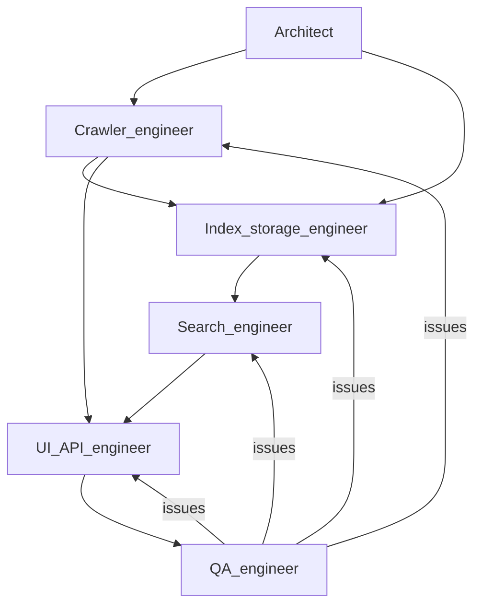

## Multi-Agent Workflow — Google in a Day (Multi-Agent Edition)

### 1. Scope

This document describes how **multiple AI agents** (each with a narrow mandate) collaborate to produce the codebase. The **running application** is not a multi-agent system: it is a normal multi-threaded Python server. The **multi-agent aspect is the development process**: division of responsibility, prompts, handoffs, and review.

**Repository state**: **Greenfield**—implementation is created step by step using [`product_prd.md`](product_prd.md), [`AGENTS.md`](AGENTS.md), and prompts under [`agents/`](agents/). Introduce **`verify_system.py`** early so checks evolve with the code (see [`agents/qa_agent.md`](agents/qa_agent.md)).

### 2. Agent roster and responsibilities

| Agent | Responsibility | Primary artifacts (to create) |
|-------|----------------|------------------------------|
| **Architect** | End-to-end design, module boundaries, concurrency and back-pressure strategy, alignment with course constraints (stdlib-only core). | [`product_prd.md`](product_prd.md) updates, high-level file map, answers to “search while indexing” design questions. |
| **Crawler engineer** | Frontier, visited set, depth \(k\), fetch/parse, worker pool, bounded queue, rate limiting, job lifecycle (pause/resume/stop, optional queue snapshot). | `crawler/indexer.py` (and package `__init__.py` if needed) |
| **Index & storage engineer** | Durable visited set, per-letter word index, per-job JSON state, locking for concurrent crawl + search. | `storage/file_store.py` |
| **Search engineer** | Tokenization, query resolution (exact + prefix), relevance scoring, pagination, sort modes, triple \((url, origin, depth)\). | `search/searcher.py` |
| **UI / API engineer** | HTTP server, HTML pages, JSON endpoints, dashboard metrics, refresh or polling for status. | `web/server.py`, `web/__init__.py` |
| **QA / integration engineer** | End-to-end checks, edge cases, verification script, regression after cross-cutting changes. | `verify_system.py` |

Detailed prompts and I/O contracts for each role live under [`agents/`](agents/).

### 3. Interaction order (typical pass)

1. **Architect** locks PRD-level decisions: stdlib-only HTTP/HTML, bounded queue back-pressure, shared `WordStore` with per-letter locks for live search.
2. **Crawler** and **Index/storage** can proceed in parallel early; crawler depends on storage APIs (`VisitedUrlsStore`, `WordStore`, `CrawlerDataStore`) once those interfaces are agreed (PRD + Architect).
3. **Search** consumes `WordStore` read API only (no crawler internals).
4. **UI/API** wires `CrawlerManager` (or equivalent) + `Searcher` into the HTTP layer.
5. **QA** maintains `verify_system.py` and manual scenarios; files issues back to the owning agent.

### 4. Prompt patterns (summary)

Each agent session uses a **system** preamble (role, non-negotiables: no Scrapy/BeautifulSoup/Selenium for core work, thread-safe shared state, explicit back-pressure) and a **user** task (specific file, acceptance criteria, link to PRD section). Instruct agents to **read the PRD and any existing modules in their dependency cone first**, match emerging project style, and **avoid drive-by refactors** outside their slice.

### 5. Decisions and trade-offs

- **Per-letter file locks** instead of a single global index lock: reduces contention versus one big JSON file while keeping a simple on-disk model.
- **Blocking producers on full queue** rather than dropping URLs: preserves crawl completeness at the cost of slower producers when the frontier explodes—acceptable for the MVP scale assumption.
- **Resume via NDJSON queue snapshot on stop** rather than continuous WAL: simpler implementation; hard crash loses pending queue (documented limitation).
- **Search during crawl** accepts **near-real-time** consistency (see PRD §4.1); no snapshot isolation for readers.

### 6. Evaluation and quality gates

- **Automated (early)**: `verify_system.py` can start with documentation, import, and wiring checks; grow into integration tests.
- **Automated (mature)**: crawl, storage, search, and API checks; all must pass before a milestone is “done.”
- **Manual**: short crawl against a small site; run search mid-crawl; confirm metrics on the status page.
- **Cross-agent review**: when one agent changes a shared contract (e.g. `WordStore.add_words` signature), confirm crawler and search callers are updated in the same change set.

### 7. Files per agent (descriptions)

See:

- [`agents/architect.md`](agents/architect.md)
- [`agents/crawler_agent.md`](agents/crawler_agent.md)
- [`agents/index_storage_agent.md`](agents/index_storage_agent.md)
- [`agents/search_agent.md`](agents/search_agent.md)
- [`agents/ui_api_agent.md`](agents/ui_api_agent.md)
- [`agents/qa_agent.md`](agents/qa_agent.md)
